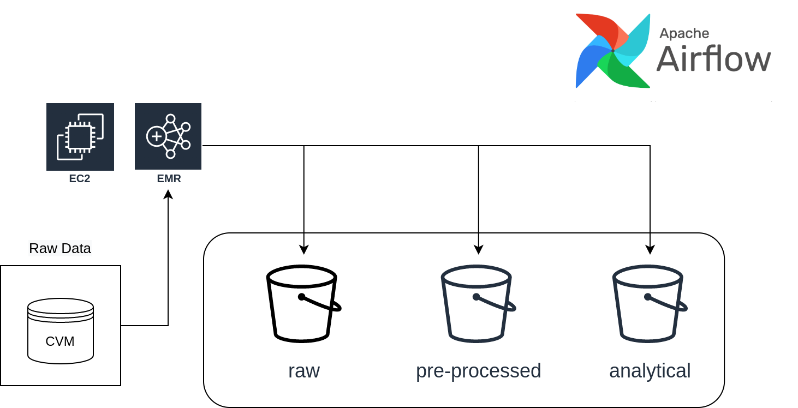
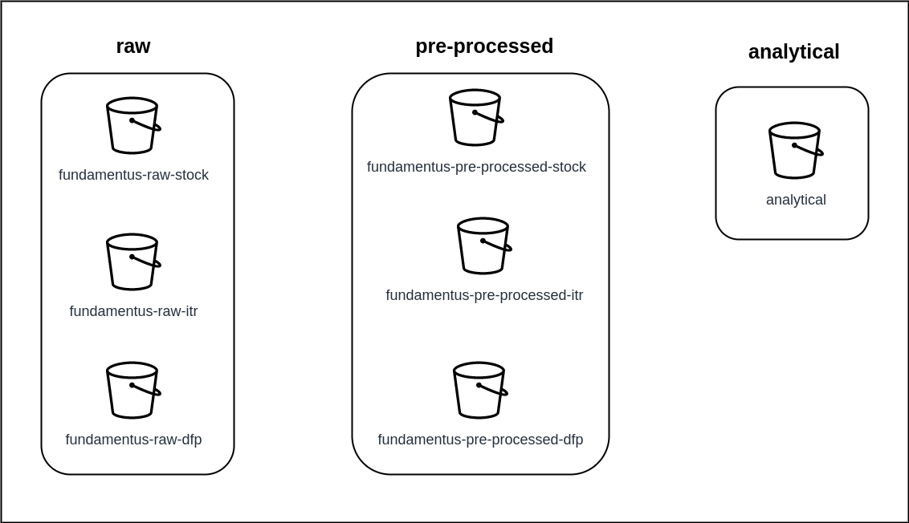

# Análise Fundamentalista

Este é um projeto cujo objetivo principal é o desenvolvimento de um pipeline de dados capaz de fornecer o acesso a diversas informações de empresas listadas na B3 para a realização de análises fundamentalistas.

As tarefas de extração de dados e pré-processamento podem ser realizadas localmente ou em cloud por meio de um container docker ou até mesmo instalando e configurando o airflow. No entanto, para os JOBs que exigem mais esforço computacional o pipeline foi construido para utilizar o serviço EMR Serveless da AWS. Ou seja, a DAG do airflow inicia um cluster EMR que consome os dados armazenados em diversos buckets da S3 e faz as transformações necessárias nos dados. Por isso, para utilização de todo o pipeline de dados desenvolvido neste projeto é preciso ter uma conta na AWS um usuário ou role IAM com as permissões para uso do serviço EMR Serveless e acesso aos buckts da S3. 

Os detalhes de como preparar o ambiente para usar esse pipeline serão abordados na seção seguinte (Preparando o ambiente), em seguida, será apresentado brevemente como o pipeline de dados esta organizado no airflow (Arquitetura do Pipeline de Dados), posteriormente mostramos o resultado desse fluxo de processamento de dados (Arquitetura do Pipeline de Dados) e, por fim, disponibilizamos uma seção de anexo com algumas informações dos dados utilizados no projeto. A imagem a seguir apresenta um resumo do fluxo da aplicação de dados:

# Preparando o Ambiente

Para rodar este pipeline você pode utilizar um container docker construído por mim a partir de uma imagem do Linux onde tanto o airflow quanto o spark são instalados. O arquivo Dockerfile é disponibilizado no repositório - fundamentalista_pipeline/docker/Dockerfile. Caso você preferir ou não tiver intimidade com docker é possível fazer a instalação do airflow "manualmente" na sua máquina ou em cloud se for o caso. Disponibilizei uma seção em um dos meus repositórios no GIT com um passo a passo para instalar o Airflow no Linux, acesse esse link: https://github.com/andre-ds/study-plan/blob/main/airflow/instalation.md e siga as instruções. Para a instalação do Spark eu sugiro usar a documentação oficial direcionada para o seu sistema operacional, fique atento para o diretório em que o spark será instalado, vamos precisar dessa informação adiante para configurar o Airflow.

Se você optou por usurfruir dos benefícios de um container docker, partindo da premissa que você já tem o docker devidamente instalado, basta seguir as instruções destacadas a seguir:

### 1. Criar a Imagem do Airflow
    
Com o terminal aberto no diretório onde o arquivo Dockerfile está, vamos gerar (buildar) a imagem com o seguinte comando:

*docker build -f Dockerfile -t andre/airflow_spark .*

andre/airflow_spark é o nome da imagem escolhido por mim, desta forma, pode ser substituida conforme a sua preferência. O ponto final indica o local onde o arquivo está armazenado, como já estamos na pasta, basta colocar esse ponto como foi sugerido. Você pode testar se tudo funcionou corretamente com o comando *docker images*.

### 2. Iniciar a Imagem
     
Para efetivamente rodar o container com a imagem do airflow bastar usar o seguinte comando:

*docker run -p 8080:8080 -v ./fundamentalista_pipeline/airflow/dags:/opt/airflow/dags -v ./fundamentalista_pipeline/datalake:/datalake/ -v ./fundamentalista_pipeline/sparkFiles:/opt/sparkFiles -it andre/airflow_spark*

Vale a pena destacar que com a instrução -p (de porta) estamos possibilitando o acesso a interface do airflow pelo navegador com a porta destacada pelo endereço *http://localhost:8080*. Além disso, compartilhamos uma série de diretórios com a opção -v (de volume). Na prática você precisa substituir pelo exato *path* do seu computador ou da instância da cloud em que o repositório foi clonado. Por exemplo, as minhas dags na verdade estão em home/andre/projects/fundamentalista_pipeline/airflow/dags:/opt/airflow/dag. Esses volumes me permitem "enxergar" os arquivos do meu computador (local) no container com o airflow instalado. Caso prefira você pode fazer os ajustes no Dockerfile definindo previamente o volume ou até copiando os códigos necessários automaticamente.

### 3. Acessar o Airflow 
    
Abre o seu navegador e acesse o link http://localhost:8080. 
A partir de agora precisamos fazer algumas configurações no airflow para poder usar todas as DAGs. 

# Configurando o Airflow

Dado a maneira como o docker foi desenvolvido, cada vez que o container for iniciado é necessário configurar o Airflow com três conexões e duas variáveis.

### 1.Conexão do Spark

Para criar as conexões no Airflow acesse o menu *Admin* seguido de *Connection*. A partir disso siga o padrão definido nas tabelas, ou seja, *Connection Id* prenecha com spark, *Connection Type* selecione Spark e assim por diante. O mesmo ocorre para a coneção da AWS Geral.

Connection Id | Connection Type | Host | Extra
------|------ |------ |------ |
spark | Spark | local | {"spark-submit": "/opt/spark/spark-3.3.1-bin-hadoop3"}

*Obs: a versão 3.3.1 do Spark é instalada no Dockerfile, caso você instale outra versão é preciso fazer o ajuste tanto do path quanto da versão na conexão.*

### 2. Conexão do AWS Geral

Connection Id | Connection Type | Extra
------|------ |------ |
aws_default | Amazon Web Services |{"aws_access_key_id": XXXX , "aws_secret_access_key": XXXX, "region_name": "us-east-2"}

Onde XXXX serão substituídos pelos respectivos key e secret key da sua chave de acesso criados por você na sua conta da AWS. Lembrando que esse chave de ter os poderes para acessar os respectivos buckets onde os dados e códigos do pipeline são armazenados, bem como, a permissão de uso do EMR Serveless. 

*Obs: Específicamente no meu caso o serviço é executado na região us-east-2 e todos os buckets estão nessa região. Faça as substituições de acordo com a sua necessidade.*

### 3. Variáveis de Ambiente
  
Para adicionar variáveis de ambiente no Airflow acesse o menu *Admin* seguido por *Variables*. 

**EMR_FUNDAMENTUS**

Adicione a Key EMR_FUNDAMENTUS com o IAM da AWS com role para acessar buckets da S3 e a autorização para usar o serviço EMR Serveless.

Caso você não saiba criá-la leia as instruções da documentação da AWS - Getting started with Amazon EMR Serverless: https://docs.aws.amazon.com/emr/latest/EMR-Serverless-UserGuide/getting-started.html#gs-prerequisites. Acesse a seção *Grant permissions to use EMR Serverless*.

**S3_LOGS_BUCKET**

A segunda variávei de ambiente define qual é o nome do bucket S3 que serão armazenados os logs dos processos que utilizam o EMR Serveless. O Key da variávei é S3_LOGS_BUCKET e o bucket que irá no campo Val no meu caso é o fundamentus-codes. Faça o ajuste conforme a nomenclatura utilizada por você na criação do cluster.

Essas variáveis de ambiente serão utilizadas para as DAGs *analytical_dre_dag.py* e *analytical_stock_price_dag.py*.

**Variáveis dos Buckets** 

Definina cada Key e o respectivo campo Val com o nome do bucket onde serão armazenados os dados.

- FUNDAMENTUS_RAW_FCA
- FUNDAMENTUS_PRE_PROCESSED_FCA_GENERAL_REGISTER
- FUNDAMENTUS_PRE_PROCESSED_FCA_STOCK_TYPE
- FUNDAMENTUS_RAW_STOCK
- FUNDAMENTUS_PRE_PROCESSED_STOCK
- FUNDAMENTUS_RAW_ITR
- FUNDAMENTUS_PRE_PROCESSED_ITR
- FUNDAMENTUS_RAW_DFP
- FUNDAMENTUS_PRE_PROCESSED_DFP
- FUNDAMENTUS_ANALYTICAL

# Arquitetura do Pipeline de Dados

O repositório está organizado em três pastas:

- airflow
- docker
- sparkFiles

 Na pasta airflow é possível acessar outro repositório chamado de dags onde cada uma das dags do pipeline está. Além disso, há uma pasta utils com os arquivos Utils.py e documents.py. O primeiro contém uma série de métodos utilizados e importados nas DAGs. Na pasta documents estão os repositórios da CVM onde os dados financeiros são extraidos e a lista contendo os períodos que são extraídos.

Em seguida, na pasta docker é armazenado somente o Dockerfile mencionado nas instruções anteriores para a criação da imagem do airflow e instalação do spark.

No diretório sparkFiles são armazenados todos os cógigos utilizados pelas DAGs para realizar a transformação dos dados. Além disso, há dois arquivos muito importante para a execução das DAGs. O arquivo python PreProcessing.py contém a classe com todos os métodos desenvolvidos para processamento dos dados. O objetivo da utilização desta classe é manter os códigos mais organizados e limpos. Há também um arquivo sparkDocuments.py que são armazenados objetos importantes para o funcionamento do pipeline. Mais especificamente ali são disponibilizados dicionários utilizados no pre-processamento dos dados finacneiros (types_dict, bpp_account, bpa_account, dre_account), schemas para garantir que os arquivos parquet sejam persistidos corretamente (schema_dre, schema_bp_ba, schema_ticker, schema_pp_dre), o path com as pastas onde os arquivos são persistidos antes de serem enviados para os buckets S3 (PATH_DATALAKE, DIR_PATH_RAW_DFP, DIR_PATH_RAW_ITR, DIR_PATH_RAW_STOCK, DIR_PATH_PROCESSED_DFP, DIR_PATH_PROCESSED_ITR, DIR_PATH_PROCESSED_STOCK, DIR_PATH_ANALYTICAL) e o mais importante os objetos com os nomes dos buckets do datalake que são utilizados no serviço EMR Serveless (DIR_S3_PROCESSED_STOCKS, DIR_S3_ANALYTICAL).

Em seguida será apresentando o papel de cada uma das DAGs no pipeline de consumo e transofmração dos dados, bem como, os outputs gerados e quais mudanças você deve fazer para salvar as informações nos seus buckets da sua conta na AWS:

DAG | Descrição
------|------ 
cvm_fca_dag | Dag responsável por extrair dados dos formulários cadastrais das empresas de capital aberto negociadas na B3.
stock_extraction_dag | Dag de extração de dados cotação de ações.
analytical_stock_price_dag | Dag de criação de variáveis relacionadadas com os dados de cotação para camada análitica.
cvm_itr_dag | Dag de extração e pré-processamento dos dados financeiros ITR cuja fonte de dados é a CVM.
cvm_dfp_dag | Dag de extração e pré-processamento dos dados financeiros DFP cuja fonte de dados é a CVM.
analytical_dre_dag | Dag responsável pela criação de variáveis analíticas relacionadas aos dados de DRE.
analytical_financial_information_dag | Dag responsável pela integração das informações de cotação, pagamento de dividendos, DRE, BPA e BPE em um único dataset. 

## cvm_fca_dag

**ext_cvm_fca**: airflow/dags/groups/group_extractions_cvm

Trata-se dos jobs responsáveis por extrairem os arquivos brutos do formulário cadastral do portal de dados. O parâmetro *dataType* define o tipo da informação.

Camada | Arquivo | Onde é Salvo | Descrição
------|------ |------ |------ 
RAW |  extracted_{extracted_at}_fca_cia_aberta_{year}.zip | Definido pelo parâmetro bucket do JOB upload_s3_raw_fca  | Onde extract_at é a referente data de extração e year é o ano da informação.

**pp_cvm_fca_aberta_geral**: airflow/dags/groups/group_pre_processing_cvm

O método pre_processing_cvm é utilizado para realizar o pré-processamento do arquivo fca_cia_aberta_geral (Seção 1 do Anexo 22 da ICVM 480). O tipo do arquivo é definido pelo parâmetro *dataType* fca_aberta_geral.

Camada | Arquivo | Onde é Salvo | Descrição
------|------ |------ |------ 
PRE-PROCESSED |  pp_fca_aberta_geral_{year}.parquet | Definido pelo parâmetro bucket do JOB upload_s3_pp_register  | Onde year é o ano da informação.

**pp_cvm_fca_valor_mobiliario**: airflow/dags/groups/group_pre_processing_cvm

O método pre_processing_cvm é utilizado para realizar o pré-processamento do arquivo fca_cia_aberta_valor_mobiliario (Seção 2 do Anexo 22 da ICVM 480). O tipo do arquivo é definido pelo parâmetro *dataType* fca_valor_mobiliario. 

Com esse documento é possível obter os tickers utilizados na B3 das empresas. Portanto, esse arquivo pré-processado é utilizado na DAG *stock_extraction* para estabelecer quais tickers serão baixados. O arquivo é salvo no seguinte padrão register_{data de execução}_stock_tickers.parquet.

Camada | Arquivo | Onde é Salvo | Descrição
------|------ |------ |------ 
PRE-PROCESSED | pp_fca_valor_mobiliario_{year}.parquet e register_{data de execução}_stock_tickers.parquet | Definido pelo parâmetro bucket do JOB upload_s3_pp_stock_type  | Onde year é o ano da informação.

## stock_extraction_dag

**stock_extractions_id**: sparkFiles/stock_extraction.py

Responsável por extrair a precificação diária de cada uma das ações utilizando os pacotes investpy (Lista de ativos) e yfinance (Extrair as cotações). Vale a pena destacar que as empresas e seus respectivos tickers que serão extraídas são determinados pelo argumento **stock_tickers**. Esse arquivo é obtido pela DAG *cvm_fca_dag* que salva o o nome do arquivo com base na da data de execução da DAG. Portanto este parâmetro deve ser atualizado conforme o arquivo é re-processado.

**union_stocks**: sparkFiles/union_stocks.py

Código responsável por unificar a precificação diária de cada empresa em um único arquivo.

**Outras dependências**: airflow/utils/Util.py: Onde o método load_bucket está disponível. load_bucket é utilizado para persistir os arquivos no bucket da S3.

**Outputs**

Camada | Arquivo | Onde é Salvo | Descrição
------|------ |------ |------ 
RAW | extracted_{extract_at}_stock.parquet | Variável de ambiente FUNDAMENTUS_RAW_STOCK  | Preço dos ativos em um determinado período, onde extract_at é a referente data de extração.
PRE-PROCESSED | pp_stock_union.parquet | Variável de ambiente FUNDAMENTUS_PRE_PROCESSED_STOCK | É a união de todos os arquivos de preços diários da camada RAW.

## analytical_stock_price_dag

A DAG para a transformações dos dados de preços das ações em uma camada análitica, ou seja, nesta camada são criadas uma série de variáveis que serão utilizadas em análises ad-hoc ou para o desenvolvimento de modelos dentro do contexto de dados de preço, volume e pagamento de dividendos. Como mencionado anteriormente, para este processamento dos dados utilizo o serviço EMR Serveless da AWS, um serviço pago que exige algumas configurações adicionais que serão descritas a seguir:

Além das variáveis de ambiente descritas na seção de *Configurando o Airflow* é preciso criar um bucket S3 onde os códigos que serão utilizados no cluster EMR, neste caso específico o path do código é disponibilizado com o parâmetro *entryPoint* e 's3://fundamentus-codes/sparkFiles/stock_price_analytical_temp.py'. Perceba que o bucket criado por mim é o fundamentus-codes seguido da pasta sparkFiles. O mesmo acontece para o outro JOB 's3://fundamentus-codes/sparkFiles/stock_price_analytical.py'. Ná prática, você precisa criar o seu bucket e substituí-lo no código.

Além disso, para salvar no cluster outras dependências de códigos isso é feito no parâmetro *sparkSubmitParameters* '--conf spark.submit.pyFiles=s3://fundamentus-codes/sparkFiles.zip'. O arquivo sparkFiles.zip contém PreProcessing.py e sparkDocuments.py compactados. Em outras palavras, esse comando copia o arquivo ZIP para dentro do cluster. **Vale a pena mencionar que se qualquer modificação é feita em alguns desses arquivos é preciso atualizar também o arquivo ZIP no bucket.**

**stock_analytical_temp_id**: sparkFiles/stock_price_analytical_temp.py

As variáveis são criadas em duas etapas, esta é a primeira e cria um arquivo temporário utilizado pelo JOB posterior.

**stock_analytical_id**: sparkFiles/stock_price_analytical.py

Etapa final da criação das variáveis da camada analítica.

Camada | Arquivo | Onde é Salvo | Descrição
------|------ |------ |------ 
ANALYTICAL | analytical_stock_price_temp.parquet | Definido pelo objeto DIR_S3_ANALYTICAL em sparkFiles/sparkDocuments  | O JOB depende do arquivo pp_stock_union.parquet da DAG anterior.
ANALYTICAL | analytical_stock_price.parquet | Definido pelo objeto DIR_S3_ANALYTICAL em sparkFiles/sparkDocuments  | É necessário atualizar o o objeto DIR_S3_ANALYTICAL com o nome do bucket da camada analítica do seu datalake.

## cvm_itr_dag e cvm_dfp_dag

**extraction_cvm**: airflow/dags/groups/group_extractions_cvm

Trata-se dos jobs responsáveis por extrairem os arquivos brutos de ITR ou DFP do portal de dados. O parâmetro *dataType* define o tipo da informação.

Camada | Arquivo | Onde é Salvo | Descrição
------|------ |------ |------ 
RAW |  extracted_{extracted_at}_cia_aberta_{year}.zip | Definido pelo parâmetro bucket do JOB upload_s3_raw_itr  | Onde extract_at é a referente data de extração e year é o ano da informação.

**pre_processing_cvm**: airflow/dags/groups/group_pre_processing_cvm

O método pre_processing_cvm é utilizado para realizar o pré-processamento dos dados de acordo com o parâmetro *dataType*, neste caso pode ser:
- itr_dre
- itr_bpp
- itr_bpa
- dfp_dre
- dfp_bpa
- dfp_bpp

Camada | Arquivo | Onde é Salvo | Descrição
PRE-PROCESSED | pp_itr_dre_2019.parquet | Definido pelo parâmetro bucket do JOB upload_s3_pp_itr ou upload_s3_pp_dfp  | Onde itr é o tipo da informação (ITR, DRE) seguido por DRE, BPP ou BPA. year é o ano da informação.

## analytical_dre_dag

Esta DAG é responsável pela criação da camada análitica das variáveis do DRE das empresas. Assim como a DAG analytical_stock_price_dag também é utilizado o serviço EMR Serveless e os códigos respectivos a essa DAG devem ser disponibilizados no bucket de código, bem como, com o arquivo compactado sparkFiles.zip como mencionado anteriormente.

**dre_union**: sparkFiles/dre_union.py

Os dados disponibilizados pelos arquivos ITR da CVM levando em consideração a referência contábil de cada empresa são do primeiro, segundo e terceiro trimestre. o JOB de união tem como objetivo além de unificar em um único arquivo todos os períodos disponibilizados obter por meio dos dados anuais FPD o último trimestre de cada ano, isso é feito por meio da diferença acumulada dos três trimestres e o resultado anual. 

Camada | Arquivo | Onde é Salvo | Descrição
------|------ |------ |------ 
ANALYTICAL | pp_stock_union.parquet | No bucket definido pelo objeto DIR_S3_ANALYTICAL que é salvo em sparkFiles/sparkDocuments  | -

**dre_analytical**: sparkFiles/dre_analytical.py

Etapa final da criação das variáveis da camada analítica das informações do DRE.

Camada | Arquivo | Onde é Salvo | Descrição
------|------ |------ |------ 
ANALYTICAL | analytical_dre.parquet | No bucket definido pelo objeto DIR_S3_ANALYTICAL que é salvo em sparkFiles/sparkDocuments  | -

## analytical_financial_information_dag

Nesta etapa para facilitar diversas análises os dados referente a cotação, pagamento de dividendos e das informações financeiras das empresas são consolidados em uma única visão

**pp_union_fin_dfp**: sparkFiles/financial_information_analytical.py

Integração sob a perspectiva anual (DFP).

**pp_union_fin_itr**: sparkFiles/financial_information_analytical.py

Integração sob a perspectiva trimestral (ITR).

Camada | Arquivo | Onde é Salvo | Descrição
------|------ |------ |------ 
ANALYTICAL | analytical_FPD_financial_information.parquet/analytical_ITR_financial_information.parquet | No bucket definido pelo objeto DIR_S3_ANALYTICAL que é salvo em sparkFiles/sparkDocuments  | -

# Arquitetura de Dados

A figura a seguir resume como o datalake está organizado em cada um dos buckets na S3.

## **Camada raw**

Essa camada armazena o dado da forma mais bruta possível, ou seja, o dado é extraido e armazenado sem ser feito nenhum tipo de alteração, inclusive de formato. Quando a informação é obtida por meio de APIs o formato salvo é o parquet.

### Taxonomia da Nomenclatura dos Arquivos Persistidos

**Nomenclatura Arquivos = extracted_data_extracao_tipo.formato**

Exemplo:

**extracted_2021_01_08_stock.parquet**

**extracted_2022_09_15_itr_cia_aberta_2021.zip**

**extracted_2022_09_15_dfp_cia_aberta_2021.zip**

Onde: 

Taxonomia | Descrição 
------|------
Data de Extração | Data pela qual o arquivo foi extraído, ou seja, a data de execução da DAG.
Tipo | Trata-se do nome do arquivo que foi disponibilizado.

Os tipos de arquivos persistidos na camada raw são os seguintes:

Abreviação | Descrição 
------|------
STOCK | Dados das negociações diária das empresas na B3.
DPF | Formulário de Demonstrações Financeiras Padronizadas.
ITR | Formulário de Informações Trimestrais.

## **Camada pre_processed**

Na segunda etapa, os dados são pré-processados e armazenados na camada **pre_processed** na sua totalidade em formato parquet. 

### Taxonomia da Nomenclatura dos Arquivos Persistidos

**Nomenclatura Arquivos = pp_data_extracao_tipo_ano.parquet**

Exemplo:

**pp_dfp_dre_2022.parquet**

**pp_dfp_BPA_2022.parquet**

**pp_itr_dre_2019.parquet**

**pp_itr_BPP_2019.parquet**

**pp_stock_union.parquet**

Onde: 

Taxonomia | Descrição 
------|------
pp | Indica que os arquivos são pré-processados.
Tipo | Diz respeito ao tipo do arquivo.
Período | Indica a janela temporal da base de dados.

**Tipo do Arquivo Extraído**

O tipo é indica, inicialmente, se é DFP ou ITR e o tipo da demonstração financeira.

Abreviação | Descrição 
------|------
STOCK | Dados das negociações diária das empresas na B3.
DPF | Formulário de Demonstrações Financeiras Padronizadas.
ITR | Formulário de Informações Trimestrais.

**Tipo da Informação**

Abreviação | Descrição 
------|------
DRE | Demonstração de Resultado.
BPA | Balanço Patrimonial Ativo.
BPP | Balanço Patrimonial Passivo.
DVA | Demonstração de Valor Adicionado.
DRA | Demonstração de Resultado Abrangente.
DMPL | Demonstração das Mutações do Patrimônio Líquido.
DFC_MD | Demonstração de Fluxo de Caixa - Método Direto.
DFC_MI | Demonstração de Fluxo de Caixa - Método Indireto.
UNION | Nos casos onde se trata de um arquivo unificado de vários outros.

### Taxonomia da Nomenclatura das Variáveis

Além disso, nesta etapa os atributos relevantes são selecionados, renomeados (com base nas regras de taxonomia) e transformados.

A nomenclatura das variáveis são construídas com base na seguinte taxonomia:

**Nomenclatura Variáveis = tipo_tema**

Exemplo:

*id_cnpj* - id indica que é um atributo de identificação cujo tema é o CNPJ da empresa. 

Onde: 

Taxonomia | Descrição 
------|------
Tipo | Indica o tipo da variável.
Tema | Diz respeito a natureza do atributo, ou seja, o que ela de fato representa.

**Tipo**
Abreviação | Descrição 
------|------
id | Representa variáveis de identificação.
txt | Texto.
dt | Variável de data.
cat | Indica uma variável categorica.
amt | Indica um montante financeiro R$.
qty | Indica quantidade.
pct | Percentual.
is | Representa uma variável binária 1 (True) ou 0 (False).

**Tema**
Nomenclatura que indica o que de fato é o dado.

## Camada analytical

### Taxonomia das Variáveis

A nomenclatura das variáveis são construídas com base na seguinte taxonomia:

**Taxonomia = tipo_medida_tema_periodo**

Onde: 

Taxonomia | Descrição 
------|------
Tipo | Indica o tipo da variável.
Medida | Nos casos onde a variável representa uma medida de resumo, indica qual a medida.
Tema | Diz respeito a natureza do atributo, ou seja, o que ela de fato representa.
Período | Quando se aplica, indica a janela utilizada para mensurar a respectiva medida.

**Tipo**
Abreviação | Descrição 
------|------
id | Representa variáveis de identificação.
dt | Variável de data.
cat | Indica uma variável categorica.
amt | Indica um montante financeiro R$.
qty | Indica quantidade.
pct | Percentual.
is | Representa uma variável binária 1 (True) ou 0 (False).

**Tema**

 Indica a natureza da variável em si. Por exemlo, sales_revenue se trata da receita de vendas da empresa.

**Medida**
Abreviação | Descrição 
------|------
avg | Média
mda | Mediana
std | Desvio Padrão
var | Variância
min | Mínimo
max | Máximo
tot | Total
tx  | Taxa

**Período**
Abreviação | Descrição 
------|------
1d | Indica uma janela de 1 (n) dia.
1m | Indica uma janela de 1 (n) mês.
1q | Indica uma janela de 1 (n) trimestre.
1s | Indica uma janela de 1 (n) semestre.
1s | Indica uma janela de 1 (n) ano.

Obs: quando p período vem acompanhado de *_lag* indica que se trata do respectivo registro anterior, ou seja, 
1q_lag indica que a variável é igual a um trimestre anterior ao respectivo período.
Assim, podemos ter as seguintes combinações de atributos do tipo lag:

Abreviação | Descrição 
------|------
1d_lag | Indica uma janela de 1 (n) dia.
1m_lag | Indica uma janela de 1 (n) mês.
1q_lag | Indica uma janela de 1 (n) trimestre.
1s_lag | Indica uma janela de 1 (n) semestre.
1s_lag | Indica uma janela de 1 (n) ano.

## Dicionário de Dados Brutos CVM

 ### Formulário Cadastral (FCA)

Trata-se de um documento obrigatório com uma série de informações cadastrais de envio periódico e eventual, previsto no artigo 21, inciso I, da Instrução CVM nº 480/09. Conjunto de dados disponibilizado:

* fca_cia_aberta_geral (Seção 1 do Anexo 22 da ICVM 480)
* fca_cia_aberta_pais_estrangeiro_negociacao (Itens 1.14 e 1.15 do Anexo 22 da ICVM 480)
* fca_cia_aberta_canal_divulgacao (Item 1.24 do Anexo 22 da ICVM 480)
* fca_cia_aberta_endereco (Itens 1.25 a 1.30 do Anexo 22 da ICVM 480)
* fca_cia_aberta_valor_mobiliario (Seção 2 do Anexo 22 da ICVM 480)
* fca_cia_aberta_auditor (Seção 3 do Anexo 22 da ICVM 480)
* fca_cia_aberta_escriturador (Seção 4 do Anexo 22 da ICVM 480)
* fca_cia_aberta_dri (Seção 5 do Anexo 22 da ICVM 480)
* fca_cia_aberta_departamento_acionistas (Seção 6 do Anexo 22 da ICVM 480)
 
 
 ### Documentos: Formulário de Demonstrações Financeiras Padronizadas (DFP)**

O Formulário de Demonstrações Financeiras Padronizadas (DFP) é formado por um conjunto de documentos encaminhados periodicamente devido a normativa 480/09 da CVM.

 ### Formulário de Informações Trimestrais (ITR)**

O ITR é semlhante ao DFP, exeto pelo fato de conter informações contáveis trimestrais.

#### Documentos
* Balanço Patrimonial Ativo (BPA)
* Balanço Patrimonial Passivo (BPP)
* Demonstração de Fluxo de Caixa - Método Direto (DFC-MD)
* Demonstração de Fluxo de Caixa - Método Indireto (DFC-MI)
* Demonstração das Mutações do Patrimônio Líquido (DMPL)
* Demonstração de Resultado Abrangente (DRA)
* Demonstração de Resultado (DRE)
    * dfp_cia_aberta_2011.zip
        * dfp_cia_aberta_DRE_con_2022.csv - Consolidada
        * dfp_cia_aberta_DRE_ind_2022.csv - Individual

* Demonstração de Valor Adicionado (DVA)

*Obs*:
Consolidado: É referente aos dados do grupo econômico pela qual a empresa faz parte.
Individual: Diz respeito a empresa que é a controladora de um grupo individual

#### Links

* Dados Disponíves: http://dados.cvm.gov.br/

* Dados Disponíves DFP: https://dados.cvm.gov.br/dataset/cia_aberta-doc-dfp

* Dados Disponíves ITR: https://dados.cvm.gov.br/dataset/cia_aberta-doc-itr

* Dicionário dos Dados ITR: http://dados.cvm.gov.br/dataset/cia_aberta-doc-itr/resource/062b8f02-ca6b-424a-bf65-180ff2b69af2