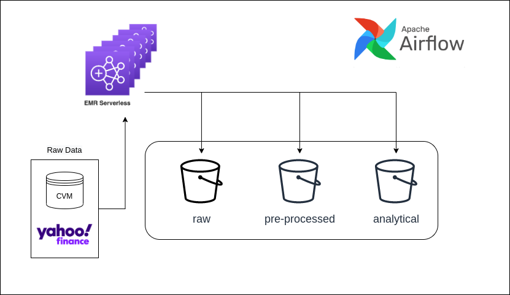

# Análise Fundamentalista

Este é um projeto cujo objetivo principal é o desenvolvimento de um pipeline de dados capaz de fornecer o acesso a diversas informações de empresas listadas na B3 para a realização de análises fundamentalistas.

As tarefas de extração de dados e pré-processamento podem ser realizadas localmente ou em cloud com um container docker ou até mesmo instalando e configurando o airflow. No entanto, para os JOBs que exigem mais esforço computacional o pipeline foi construido para utilizar o serviço EMR Serveless da AWS. Ou seja, a DAG do airflow inicia um cluster EMR que consome os dados armazenados em diversos buckets da S3 e faz as transformações necessárias nos dados. A imagem a seguir apresenta um resumo do fluxo da aplicação de dados:

# Preparando o Ambiente

Para rodar este pipeline você pode utilizar um container docker construído por mim a partir de uma imagem do ubuntu disponível no repositório - fundamentalista_pipeline/docker/Dockerfile - ou realizar a instalação do airflow.

Caso você opte por fazer a instalação do Airflow acesse esse link: https://github.com/andre-ds/study-plan/blob/main/airflow/instalation.md e siga os passos.

Se preferer usurfruir dos benefícios de um container docker, partindo da premissa que você já tem o docker devidamente instalado, basta seguir as instruções destacadas a seguir:

1. Criar a Imagem do Airflow
    
Com o terminal aberto no diretório onde o arquivo Dockerfile está, vamos gerar (buildar) a imagem com o seguinte comando:

*docker build -f Dockerfile -t andre/airflow_spark .*

andre/airflow_spark é a denominação da imagem é pode ser substituida conforme a sua preferência. O ponto final indica o local onde o arquivo está armazenado, como já estamos na pasta, basta colocar esse ponto como foi sugerido. Você pode testar se tudo funcionou corretamente com o comando *docker images*.

2. Iniciar a Imagem
     
Para efetivamente rodar o container com a imagem do airflow bastar usar o seguinte comando:

*docker run -p 8080:8080 -v ./fundamentalista_pipeline/airflow/dags:/opt/airflow/dags -v ./fundamentalista_pipeline/datalake:/datalake/ -v ./fundamentalista_pipeline/sparkFiles:/opt/sparkFiles -it andre/airflow_spark*

Vale a pena destacar que com a instrução -p de porta estamos possibilitando o acesso a interface do airflow pelo navegado com o endereço *http://localhost:8080*. Além disso, compartilhamos uma série de diretórios com a opção -v de volume. Na prática você precisa substituir pelo exato *path* do seu computador ou na cloud em que o repositório foi clonado. Por exemplo, as minhas dags na verdade estão em home/andre/projects/fundamentalista_pipeline/airflow/dags:/opt/airflow/dag. Esses volumes me permitem "enxergar" os arquivos do meu computador no container com o airflow instalado. 

3. Acessar o Airflow 
    
Abre o seu navegador e acesse o link http://localhost:8080. 
A partir de agora precisamos fazer algumas configurações no airflow para poder usar todas as DAGs. 

# Configurando o Airflow

Dado a maneira como o docker foi desenvolvido, cada vez que o container for iniciado se faz necessário criar três conexões e duas variáveis. 

Para adicionar as variáveis de ambiente no Airflow acesse o menu *Admin* seguido por *Variables*. Adicione a Key EMR_FUNDAMENTUS com o IAM da AWS com role para acessar buckets da S3 e o serviço EMR. Essa variável de ambiente vai permitir que possamos usar o serviço da EMR Serveless, caso você não saiba criá-la leia as instruções da documentação da AWS - Getting started with Amazon EMR Serverless: https://docs.aws.amazon.com/IAM/latest/UserGuide/getting-set-up.html#create-an-admin.

A segunda variávei de ambiente define o bucket S3 que serrão armazenados os logs dos dos processos do EMR Serveless. O Key da variávei é S3_LOGS_BUCKET e o bucket que irá no campo Val é fundamentus-codes. 

Essas variáveis de ambiente serão utilizadas para as DAGs *analytical_dre_dag.py* e *analytical_stock_price_dag.py*.

Quanto as conexões para criá-las acesse *Admin* e *Connection*, é preciso criar três conexões:

**Conexão do Spark**
Connection Id | Connection Type | Host | Extra
------|------ |------ |------ |
spark | Spark | local | {"spark-submit": "/opt/spark/spark-3.3.1-bin-hadoop3"}

*Obs: a versão 3.3.1 do Spark é instalada no Dockerfile, caso você instale outra versão é preciso fazer o ajuste tanto do path quanto da versão na conexão.*

**Conexão do S3**
Connection Id | Connection Type | Extra
------|------ |------ |
s3_conn | Amazon Web Services | {"aws_access_key_id":XXXX, "aws_secret_access_key": XXXX}

*Onde XXXX serão substituídos pelos respectivos key e secret key de acesso aos buckts criados por você na sua conta da AWS.*

**Conexão do AWS Geral**

Connection Id | Connection Type | Extra
------|------ |------ |
aws_default | Amazon Web Services | {"aws_access_key_id": XXXX , "aws_secret_access_key": XXXX, "region_name": "us-east-2"}

*Obs: Essa conexão é utilizada pelo serviço EMR Serveless. Específicamente no meu caso o serviço é executado na região us-east-2. Faça as substituições de acordo com a sua necessidade.*

# Arquitetura do Pipeline de Dados

DAG | Descrição
------|------ 
cvm_registration_dag | Dag responsável por extrair dados cadastrais das empresas de capital aberto negociadas na B3.
stock_extraction_dag | Dag de extração de dados cotação de ações.
analytical_stock_price_dag | Dag de criação de variáveis relacionadadas com os dados de cotação para camada análitica.
cvm_itr_dag | Dag de extração e pré-processamento dos dados financeiros ITR cuja fonte de dados é a CVM.
cvm_dfp_dag | Dag de extração e pré-processamento dos dados financeiros DFP cuja fonte de dados é a CVM.
analytical_dre_dag | Dag responsável pela criação de variáveis analíticas relacionadas aos dados de DRE.

# Arquitetura de Dados

## **Camada raw**

A primeira etapa consiste na extração dos dados de empresas disponíveis na CVM e persistência deles na camada **Raw** do datalake na AWS. Essa camada armazena o dado da forma mais bruta, ou seja, o dado é extraido e armazenado sem ser feito nenhum tipo de alteração, inclusive de formato, mantendo-se assim o formato original (zip).

### Taxonomia da Nomenclatura dos Arquivos Persistidos

**Nomenclatura Arquivos = extracted_data_extracao_tipo.formato**

Exemplo:

**extracted_2022_09_15_dfp_cia_aberta_2021.zip**

Onde: 

Taxonomia | Descrição 
------|------
Data de Extração | Data pela qual o arquivo foi extraído.
Tipo | Trata-se do nome do arquivo que foi disponibilizado.

## **Camada pre_processed**

Na segunda etapa, os dados são pré-processados e armazenados na camada **pre_processed** do datalake em formato parquet. 

### Taxonomia da Nomenclatura dos Arquivos Persistidos

**Nomenclatura Arquivos = pp_data_extracao_tipo_ano.parquet**

Exemplo:

**pp_dfp_dre_2022.parquet**

Onde: 

Taxonomia | Descrição 
------|------
pp | Indica que os arquivos são pré-processados.
Data de Extração | Data pela qual o arquivo foi extraído.
Tipo | Diz respeito ao tipo do documento disponibilizado pela CVM.
Período | Indica a janela temporal da base de dados.

**Tipo**

O tipo é indica, inicialmente, se é DFP ou ITR e o tipo da demonstração financeira.

Abreviação | Descrição 
------|------
DPF | Formulário de Demonstrações Financeiras Padronizadas.
ITR | Formulário de Informações Trimestrais.

Abreviação | Descrição 
------|------
DRE | Demonstração de Resultado.
BPA | Balanço Patrimonial Ativo.
BPP | Balanço Patrimonial Passivo.
DVA | Demonstração de Valor Adicionado.
DRA | Demonstração de Resultado Abrangente.
DMPL | Demonstração das Mutações do Patrimônio Líquido.
DFC_MD | Demonstração de Fluxo de Caixa - Método Direto.
DFC_MI | Demonstração de Fluxo de Caixa - Método Indireto.

### Taxonomia da Nomenclatura das Variáveis

Além disso, nesta etapa os atributos relevantes são selecionados, renomeados (com base nas regras de taxonomia) e transformados.

A nomenclatura das variáveis são construídas com base na seguinte taxonomia:

**Nomenclatura Variáveis = tipo_tema**

Exemplo:

*id_cnpj* - id indica que é um atributo de identificação cujo tema é o CNPJ da empresa. 

Onde: 

Taxonomia | Descrição 
------|------
Tipo | Indica o tipo da variável.
Tema | Diz respeito a natureza do atributo, ou seja, o que ela de fato representa.

**Tipo**
Abreviação | Descrição 
------|------
id | Representa variáveis de identificação.
txt | Texto.
dt | Variável de data.
cat | Indica uma variável categorica.
amt | Indica um montante financeiro R$.
qty | Indica quantidade.
pct | Percentual.
is | Representa uma variável binária 1 (True) ou 0 (False).

**Tema**
Nomenclatura que indica o que de fato é o dado.

## Camada analytical

### Taxonomia das Variáveis

A nomenclatura das variáveis são construídas com base na seguinte taxonomia:

**Taxonomia = tipo_medida_tema_periodo**

Onde: 

Taxonomia | Descrição 
------|------
Tipo | Indica o tipo da variável.
Medida | Nos casos onde a variável representa uma medida de resumo, indica qual a medida.
Tema | Diz respeito a natureza do atributo, ou seja, o que ela de fato representa.
Período | Quando se aplica, indica a janela utilizada para mensurar a respectiva medida.

**Tipo**
Abreviação | Descrição 
------|------
id | Representa variáveis de identificação.
dt | Variável de data.
cat | Indica uma variável categorica.
amt | Indica um montante financeiro R$.
qty | Indica quantidade.
pct | Percentual.
is | Representa uma variável binária 1 (True) ou 0 (False).

**Tema**

 Indica a natureza da variável em si. Por exemlo, sales_revenue se trata da receita de vendas da empresa.

**Medida**
Abreviação | Descrição 
------|------
avg | Média
mda | Mediana
std | Desvio Padrão
var | Variância
min | Mínimo
max | Máximo
tot | Total
tx  | Taxa

**Período**
Abreviação | Descrição 
------|------
1d | Indica uma janela de 1 (n) dia.
1m | Indica uma janela de 1 (n) mês.
1q | Indica uma janela de 1 (n) trimestre.
1s | Indica uma janela de 1 (n) semestre.
1s | Indica uma janela de 1 (n) ano.

Obs: quando p período vem acompanhado de *_lag* indica que se trata do respectivo registro anterior, ou seja, 
1q_lag indica que a variável é igual a um trimestre anterior ao respectivo período.
Assim, podemos ter as seguintes combinações de atributos do tipo lag:

Abreviação | Descrição 
------|------
1d_lag | Indica uma janela de 1 (n) dia.
1m_lag | Indica uma janela de 1 (n) mês.
1q_lag | Indica uma janela de 1 (n) trimestre.
1s_lag | Indica uma janela de 1 (n) semestre.
1s_lag | Indica uma janela de 1 (n) ano.

## Dicionário de Dados Brutos CVM

**Documentos: Formulário de Demonstrações Financeiras Padronizadas (DFP)**

O Formulário de Demonstrações Financeiras Padronizadas (DFP) é formado por um conjunto de documentos encaminhados periodicamente devido a normativa 480/09 da CVM.

**Formulário de Informações Trimestrais (ITR)**

O ITR é semlhante ao DFP, exeto pelo fato de conter informações contáveis trimestrais.

#### Documentos
* Balanço Patrimonial Ativo (BPA)
* Balanço Patrimonial Passivo (BPP)
* Demonstração de Fluxo de Caixa - Método Direto (DFC-MD)
* Demonstração de Fluxo de Caixa - Método Indireto (DFC-MI)
* Demonstração das Mutações do Patrimônio Líquido (DMPL)
* Demonstração de Resultado Abrangente (DRA)
* Demonstração de Resultado (DRE)
    * dfp_cia_aberta_2011.zip
        * dfp_cia_aberta_DRE_con_2022.csv - Consolidada
        * dfp_cia_aberta_DRE_ind_2022.csv - Individual

* Demonstração de Valor Adicionado (DVA)

*Obs*:
Consolidado: É referente aos dados do grupo econômico pela qual a empresa faz parte.
Individual: Diz respeito a empresa que é a controladora de um grupo individual

#### Links

* Dados Disponíves: http://dados.cvm.gov.br/

* Dados Disponíves DFP: https://dados.cvm.gov.br/dataset/cia_aberta-doc-dfp

* Dados Disponíves ITR: https://dados.cvm.gov.br/dataset/cia_aberta-doc-itr

* Dicionário dos Dados ITR: http://dados.cvm.gov.br/dataset/cia_aberta-doc-itr/resource/062b8f02-ca6b-424a-bf65-180ff2b69af2